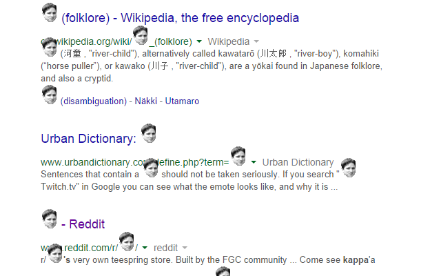
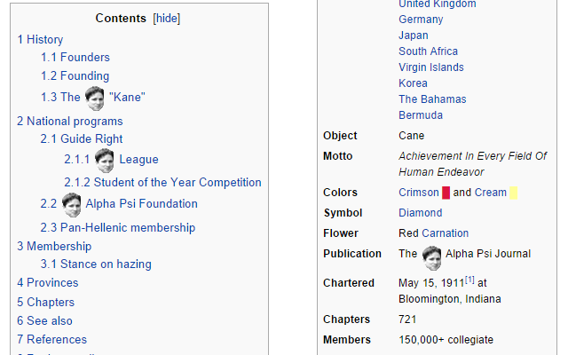

This is an extension that replaces Twitch emote text with the actual emote on any website. It even replaces emotes in other chatrooms dynamically!

Optionally use only global emotes, sub emotes, both global+sub emotes, or just use "Kappa".

If you find any bugs, let me know! popcorncolonel@gmail.com

Screenshots:  

